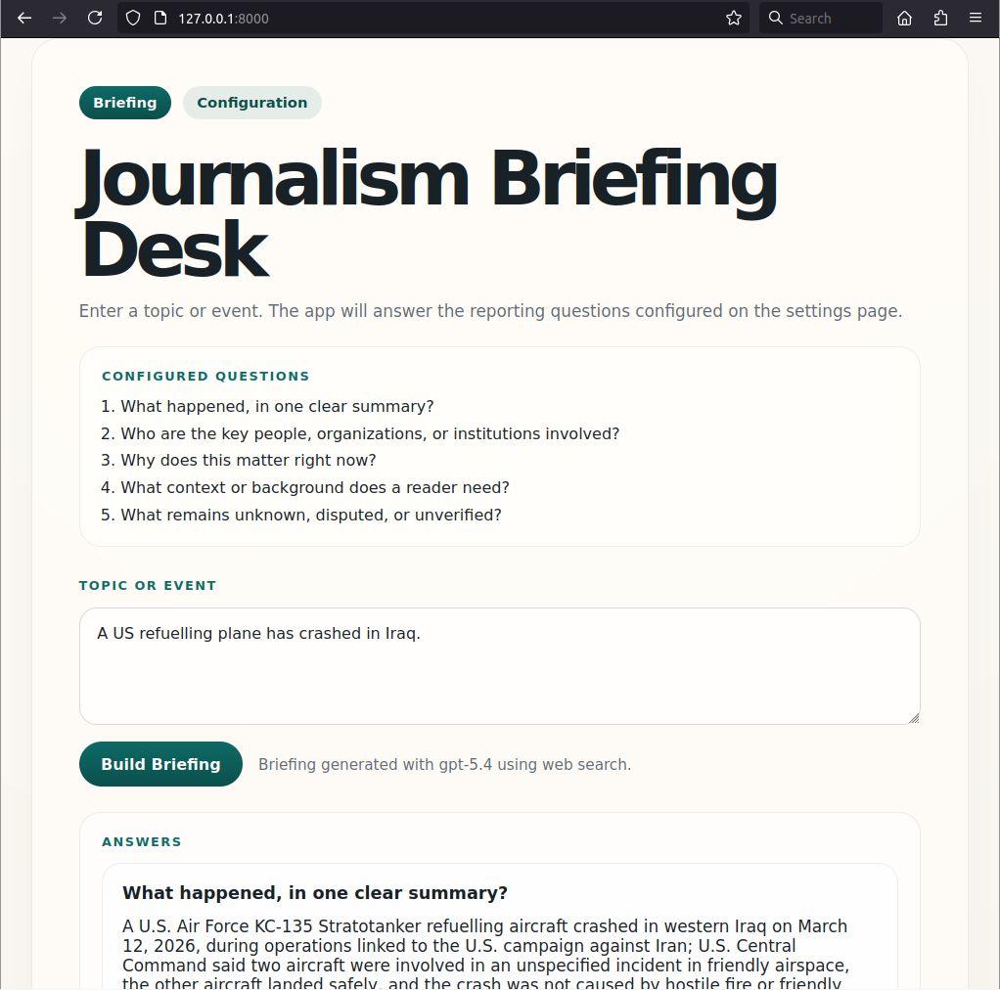

# News Assist

News Assist is a local journalism briefing tool with a Python backend and browser UI.

The repository does not include a real OpenAI API key. Use your own local `.env` file.

## Preview

See [all screenshots](SCREENSHOTS.md).

## Setup

1. Copy `.env.example` to `.env`.
2. Put your own OpenAI API key in `.env`.
3. Start the app:
   - macOS/Linux: `python3 app.py`
   - Windows: `python app.py`
4. Open `http://127.0.0.1:8000/` in your browser.

## Notes

- `.env` is ignored by git and should not be committed.
- If port `8000` is already in use, change `PORT` in `.env`.

\- by Mick de Neeve (codex-assisted, March 2026)
